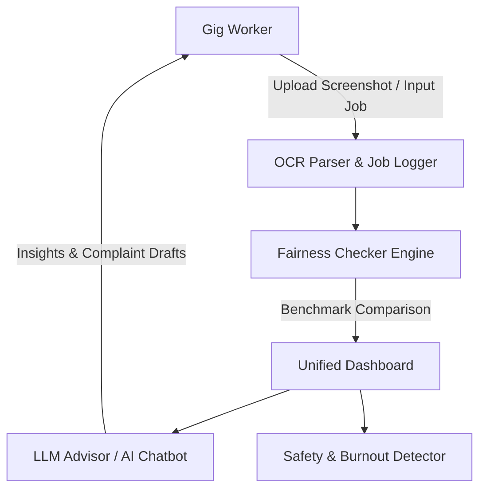

# GigShield Hackathon Package (`gigshield_worker_companion`)

Welcome to the GigShield Hackathon Project! This repository serves as your starter template and full implementation for "GigShield", an AI-powered financial coach and safety companion for gig platform workers.

Our goal is to aggregate multi-platform earnings, validate fare fairness against benchmark rates, provide accessible AI guidance, detect worker fatigue, and auto-generate complaint drafts or safety alerts when issues arise.

---

## 1. System Architecture

Below is the component architecture of GigShield.We are responsible for configuring the environment and running the required services.


### Component Summary Table

| Service / Module Name | Executable / Command | Main File | Description |
| :--- | :--- | :--- | :--- |
| `/earnings_aggregator` | `aggregate` | `src/utils/aggregator.js` | Merges shift and earnings data across multiple gig platforms. |
| `/fairness_checker` | `evaluate` | `src/utils/fairness.js` | Compares logged job payouts against benchmark rate datasets. |
| `/llm_advisor` | `advisor` | `src/utils/llm.js` | Drives the AI chatbot and weekly insight summary generation. |
| `/ocr_parser` | `scan` | `src/utils/ocr.js` | Extracts fare, time, and distance from app screenshots. |

---

## 2. Core Requirements Implemented

* **Multi-Platform Earnings Aggregator:** Logs and unifies earnings from various delivery/ride-share platforms in a single dashboard.
* **OCR Job Logging:** Auto-extracts fare, distance, and duration from app screenshots using Tesseract/Vision OCR.
* **Fairness-Check Model:** Flags potential underpayments by comparing actual payouts to expected distance/time benchmarks.
* **AI Rights & Fare Advisor:** Interactive AI chatbot answering plain-language questions like *"Is this fare fair?"* and *"What are my rights?"*.
* **Weekly AI Insights:** Context-aware analytical summary detailing earnings trends, shift anomalies, and underpayment patterns.

---

## 3. Bonus Features Implemented

* **Voice-Based Interaction:** Speech-to-text option for low-literacy accessibility.
* **AI Complaint Drafter:** Auto-generates formal complaint text when an underpaid job is flagged.
* **Fatigue / Burnout Detector:** Monitors long consecutive working hours and prompts rest recommendations.
* **"I Feel Unsafe" Trigger:** One-tap emergency alert that drafts and sends location data to a trusted contact.

---

## 4. How to Run This Project

### Environment Setup

1. Copy the example environment configuration:
   ```bash
   cp .env.example .env

